# Contract Architecture - OFFER-HUB

## System Flow Diagrams

### Complete Workflow - Step-by-Step View

```mermaid
flowchart TB
    subgraph Fase1["📝 PHASE 1: REGISTRATION AND SETUP"]
        direction TB
        A1[👤 User accesses platform] 
        A2{Already registered?}
        A3[📋 UserRegistry<br/>Register user<br/>- Username<br/>- Email<br/>- IPFS Profile<br/>- Role: Client/Freelancer]
        A4[✅ User registered]
        
        A1 --> A2
        A2 -->|No| A3
        A2 -->|Yes| A4
        A3 --> A4
    end
    
    subgraph Fase2["🎯 PHASE 2: PROJECT CREATION"]
        direction TB
        B1[💼 Client creates project]
        B2[📄 ProjectManager<br/>createProject<br/>- Title<br/>- Description<br/>- Budget<br/>- Deadline<br/>Status: DRAFT]
        B3[📢 ProjectManager<br/>publishProject<br/>Status: PUBLISHED]
        B4[🔍 Freelancers see project]
        
        B1 --> B2
        B2 --> B3
        B3 --> B4
    end
    
    subgraph Fase3["🤝 PHASE 3: ASSIGNMENT"]
        direction TB
        C1[👨‍💻 Client selects freelancer]
        C2[📌 ProjectManager<br/>assignFreelancer<br/>Status: IN_PROGRESS]
        C3[✅ Freelancer assigned]
        
        C1 --> C2
        C2 --> C3
    end
    
    subgraph Fase4["💰 PHASE 4: ESCROW FUNDING"]
        direction TB
        D1[💵 Client funds escrow]
        D2[🔒 EscrowPayment<br/>createPayment<br/>- Amount<br/>- Token: AVAX/ERC20<br/>Status: PENDING]
        D3[✅ EscrowPayment<br/>PaymentFunded<br/>Status: FUNDED]
        D4[💼 Funds locked in escrow]
        
        D1 --> D2
        D2 --> D3
        D3 --> D4
    end
    
    subgraph Fase5["⚙️ PHASE 5: EXECUTION"]
        direction TB
        E1[🛠️ Freelancer works]
        E2[📦 Freelancer completes milestones]
        E3[📝 ProjectManager<br/>completeMilestone<br/>- Deliverable IPFS]
        E4[✅ Milestone completed]
        
        E1 --> E2
        E2 --> E3
        E3 --> E4
    end
    
    subgraph Fase6["✅ PHASE 6: VERIFICATION"]
        direction TB
        F1[📤 Freelancer submits work]
        F2[🔍 WorkVerification<br/>submitWork<br/>- Work Hash IPFS<br/>- Evidence]
        F3[👀 Client reviews work]
        F4{Approved?}
        F5[✅ WorkVerification<br/>verifyWork<br/>Status: VERIFIED]
        F6[❌ WorkVerification<br/>verifyWork<br/>Status: REJECTED]
        
        F1 --> F2
        F2 --> F3
        F3 --> F4
        F4 -->|Yes| F5
        F4 -->|No| F6
        F6 --> E1
    end
    
    subgraph Fase7["💸 PHASE 7: PAYMENT"]
        direction TB
        G1[✅ Client approves work]
        G2[📄 ProjectManager<br/>completeProject<br/>Status: COMPLETED]
        G3[💸 EscrowPayment<br/>releasePayment<br/>- Calculate fee 2.5%<br/>- Transfer to freelancer<br/>- Transfer fee<br/>Status: RELEASED]
        G4[📊 UserStatistics<br/>recordWork<br/>- Record work<br/>- Update stats<br/>- Save rating]
        G5[🎉 Project completed]
        
        G1 --> G2
        G2 --> G3
        G3 --> G4
        G4 --> G5
    end
    
    A4 --> B1
    B4 --> C1
    C3 --> D1
    D4 --> E1
    E4 --> F1
    F5 --> G1
    
    style Fase1 fill:#e3f2fd
    style Fase2 fill:#f3e5f5
    style Fase3 fill:#e8f5e9
    style Fase4 fill:#fff3e0
    style Fase5 fill:#e1f5fe
    style Fase6 fill:#fce4ec
    style Fase7 fill:#e0f2f1
```



### Cross-Chain (Multichain) Flow - Detailed View


### Contract Architecture


### Project States


### Payment States


### Escrow Payment Flow - Detailed View

```mermaid
flowchart TB
    subgraph Paso1["STEP 1: PAYMENT CREATION"]
        direction TB
        P1A[💼 Client has project<br/>Status: IN_PROGRESS]
        P1B[💰 Client calls<br/>EscrowPayment.createPayment<br/>- projectId<br/>- token: AVAX or ERC20<br/>- amount]
        P1C[🔍 Validations:<br/>- Project exists<br/>- Client is owner<br/>- Freelancer assigned<br/>- No previous payment]
        P1D[📝 Create Payment struct<br/>Status: PENDING]
        P1E{Is token AVAX?}
        P1F[💵 Receive AVAX<br/>Status: FUNDED]
        P1G[⏳ Wait for approve<br/>Status: PENDING]
        
        P1A --> P1B
        P1B --> P1C
        P1C --> P1D
        P1D --> P1E
        P1E -->|Yes| P1F
        P1E -->|No| P1G
    end
    
    subgraph Paso2["STEP 2: FUNDING"]
        direction TB
        P2A[💵 If ERC20:<br/>Client approves]
        P2B[💰 EscrowPayment<br/>fundPaymentWithToken<br/>transferFrom client → contract]
        P2C[✅ Payment<br/>Status: FUNDED<br/>fundedAt: timestamp]
        P2D[🔒 Funds locked<br/>in contract]
        
        P1G --> P2A
        P2A --> P2B
        P2B --> P2C
        P2C --> P2D
        P1F --> P2D
    end
    
    subgraph Paso3["STEP 3: WORK AND VERIFICATION"]
        direction TB
        P3A[🛠️ Freelancer works]
        P3B[📦 Freelancer completes work]
        P3C[✅ WorkVerification<br/>verifyWork<br/>Status: VERIFIED]
        P3D[📄 ProjectManager<br/>completeProject<br/>Status: COMPLETED]
        
        P2D --> P3A
        P3A --> P3B
        P3B --> P3C
        P3C --> P3D
    end
    
    subgraph Paso4["STEP 4: RELEASE"]
        direction TB
        P4A[💸 Client calls<br/>EscrowPayment.releasePayment<br/>- paymentId<br/>- workHash<br/>- rating: 1-5]
        P4B[🔍 Validations:<br/>- Payment FUNDED<br/>- Client is owner<br/>- Project COMPLETED]
        P4C[🧮 Calculate fees:<br/>fee = amount * 2.5%<br/>freelancerAmount = amount - fee]
        P4D{Is token AVAX?}
        P4E[💵 Transfer AVAX:<br/>fee → feeRecipient<br/>freelancerAmount → freelancer]
        P4F[🪙 Transfer ERC20:<br/>fee → feeRecipient<br/>freelancerAmount → freelancer]
        P4G[📝 Update Payment:<br/>Status: RELEASED<br/>releasedAt: timestamp<br/>workHash: hash]
        P4H[📊 UserStatistics<br/>recordWork<br/>- projectId<br/>- amount<br/>- rating<br/>- workHash]
        P4I[✅ Payment completed]
        
        P3D --> P4A
        P4A --> P4B
        P4B --> P4C
        P4C --> P4D
        P4D -->|Yes| P4E
        P4D -->|No| P4F
        P4E --> P4G
        P4F --> P4G
        P4G --> P4H
        P4H --> P4I
    end
    
    style Paso1 fill:#e3f2fd
    style Paso2 fill:#fff3e0
    style Paso3 fill:#e8f5e9
    style Paso4 fill:#e0f2f1
```



### Work Verification Flow - Detailed View

```mermaid
flowchart TB
    subgraph Inicio["START: WORK COMPLETED"]
        direction TB
        I1[🛠️ Freelancer completes work]
        I2[📦 Freelancer has:<br/>- Code/deliverables<br/>- Evidence<br/>- Documentation]
    end
    
    subgraph Creacion["VERIFICATION CREATION"]
        direction TB
        C1[📝 Client or Freelancer calls<br/>WorkVerification.createVerification<br/>- projectId]
        C2[🔍 Validations:<br/>- Project exists<br/>- Status: IN_PROGRESS or COMPLETED<br/>- Freelancer assigned]
        C3[📋 Create Verification struct<br/>- verificationId<br/>- projectId<br/>- freelancer<br/>- client<br/>- requirementsHash<br/>Status: PENDING]
        C4[✅ Verification created]
        
        I2 --> C1
        C1 --> C2
        C2 --> C3
        C3 --> C4
    end
    
    subgraph Envio["WORK SUBMISSION"]
        direction TB
        E1[📤 Freelancer calls<br/>WorkVerification.submitWork<br/>- verificationId<br/>- workHash: IPFS<br/>- evidenceHashes: IPFS[]]
        E2[🔍 Validations:<br/>- Verification PENDING<br/>- Freelancer is owner<br/>- workHash not empty]
        E3[📝 Update Verification:<br/>- workHash<br/>- submittedAt: timestamp<br/>- meetsDeadline: bool]
        E4[📎 Save WorkEvidence:<br/>- evidenceHashes[]<br/>- timestamp<br/>- submitter]
        E5[✅ Work submitted]
        
        C4 --> E1
        E1 --> E2
        E2 --> E3
        E3 --> E4
        E4 --> E5
    end
    
    subgraph Revision["REVIEW AND VERIFICATION"]
        direction TB
        R1[👀 Client reviews work]
        R2[🔍 Client or Oracle calls<br/>WorkVerification.verifyWork<br/>- verificationId<br/>- verified: bool<br/>- reason: string]
        R3[🔍 Validations:<br/>- Verification PENDING<br/>- Work submitted<br/>- Client or Oracle authorized]
        R4{Approved?}
        R5[✅ Status: VERIFIED<br/>- verifier: address<br/>- verifiedAt: timestamp]
        R6[❌ Status: REJECTED<br/>- rejectionReason: string]
        R7[📊 UserStatistics<br/>verifyWorkDelivery<br/>- onTimeDelivery: bool]
        R8[🔄 If rejected:<br/>Freelancer can add evidence<br/>addEvidence()]
        
        E5 --> R1
        R1 --> R2
        R2 --> R3
        R3 --> R4
        R4 -->|Yes| R5
        R4 -->|No| R6
        R5 --> R7
        R6 --> R8
        R8 --> E1
    end
    
    subgraph Final["RESULT"]
        direction TB
        F1[✅ Work verified<br/>Client can release payment]
        F2[❌ Work rejected<br/>Freelancer must correct]
        
        R7 --> F1
        R6 --> F2
    end
    
    style Inicio fill:#e1f5fe
    style Creacion fill:#f3e5f5
    style Envio fill:#e8f5e9
    style Revision fill:#fff3e0
    style Final fill:#e0f2f1
```

## Contracts

### UserRegistry

User registration with verification.

- Each user has profile with IPFS hash
- Optional verification (KYC, Social, Reputation)
- Only the user can update their profile

### ProjectManager

Project management.

**States:**
- Draft → Published → InProgress → Completed
- Can also be Cancelled or Disputed

**Flow:**
1. Client creates project (Draft)
2. Client publishes (Published)
3. Client assigns freelancer (InProgress)
4. Freelancer completes milestones
5. Client completes project (Completed)

### EscrowPayment

Escrow payments using SRCW.

- Deposits funds in escrow
- Releases payment after verifying work
- Platform fee: 2.5% by default
- Supports native AVAX and ERC20 tokens

### WorkVerification

Work verification.

- Freelancer submits work with IPFS hash
- Client or oracle verifies
- Deadline tracking
- Additional evidence system

### UserStatistics

Immutable freelancer statistics.

- Work history
- Ratings and average
- On-time delivery metrics
- Total earned
- Everything immutable once recorded

## Contract Dependencies

```
UserRegistry (independent)
    ↓
UserStatistics (independent)
    ↓
ProjectManager (requires UserRegistry)
    ↓
EscrowPayment (requires ProjectManager, UserStatistics)
    ↓
WorkVerification (requires all)
```

## Complete Flow

1. User registers in UserRegistry
2. Client creates project in ProjectManager
3. Client funds escrow in EscrowPayment
4. Freelancer completes work
5. Freelancer submits work in WorkVerification
6. Client verifies in WorkVerification
7. Client releases payment in EscrowPayment
8. EscrowPayment automatically records in UserStatistics

## Security

- ReentrancyGuard in EscrowPayment
- Input validation in all functions
- Modifiers for access control
- Immutable data once registered
- OpenZeppelin for secure functions

## Gas Optimization

- Separate mappings for history (avoids gas issues)
- Pagination in getWorkHistory
- Events for off-chain indexing
- Packed structs where possible

## Multichain Architecture

### Cross-Chain Contracts

OFFER-HUB implements multichain capabilities using Avalanche technologies to meet hackathon criteria, specifically the use of Avalanche-specific components (Cross-Chain with ICM, Avalanche L1s, etc).

#### IAvalancheICM / IAvalancheTeleporter

Interfaces for cross-chain communication with Avalanche:
- **IAvalancheICM**: Interface for the Inter-Chain Message (ICM) protocol
- **IAvalancheTeleporter**: Alternative interface for Avalanche's Teleporter system

**Features:**
- Sending messages between different Avalanche L1s (C-Chain, X-Chain, P-Chain)
- Receiving and verifying cross-chain messages
- Tracking message status

#### CrossChainManager

Centralized manager for all cross-chain operations.

**Features:**
- Registration of contracts on different Avalanche blockchains
- Initiation of cross-chain operations (ProjectCreation, PaymentInitiation, PaymentRelease, etc)
- Receiving and processing cross-chain operations
- Tracking operation status (Pending, Sent, Received, Completed, Failed)
- Support for multiple protocols (ICM and Teleporter)

**Supported Chain IDs:**
- C-Chain (Mainnet): `43114`
- X-Chain: `2`
- P-Chain: `0`
- Fuji C-Chain (Testnet): `43113`

**Operation types:**
- `ProjectCreation`: Cross-chain project creation
- `PaymentInitiation`: Cross-chain payment initiation
- `PaymentRelease`: Cross-chain payment release
- `ProjectCompletion`: Cross-chain project completion
- `UserRegistration`: Cross-chain user registration

#### CrossChainProjectManager

Extends `ProjectManager` with cross-chain capabilities.

**Features:**
- Creating projects on multiple Avalanche blockchains
- Receiving projects from other blockchains
- Synchronizing project states between chains
- Tracking cross-chain projects with unique IDs

**Cross-Chain Project Flow:**
1. Client creates cross-chain project on Chain A
2. `CrossChainManager` sends message to Chain B using ICM/Teleporter
3. `CrossChainProjectManager` on Chain B receives and creates the project
4. States synchronize between both chains

#### CrossChainEscrow

Extends `EscrowPayment` with cross-chain capabilities.

**Features:**
- Creating escrow payments on multiple blockchains
- Receiving payments from other blockchains
- Releasing cross-chain payments with notification between chains
- Tracking cross-chain payments with unique IDs

**Cross-Chain Payment Flow:**
1. Client creates escrow payment on Chain A
2. `CrossChainManager` sends message to Chain B
3. `CrossChainEscrow` on Chain B receives and creates the payment
4. When payment is released, Chain A is notified

### Multichain Dependencies

```
CrossChainManager (independent, requires ICM/Teleporter)
    ↓
CrossChainProjectManager (requires ProjectManager, CrossChainManager)
    ↓
CrossChainEscrow (requires EscrowPayment, CrossChainManager)
```

### Complete Multichain Flow

**Scenario: Client on C-Chain, Freelancer on X-Chain**

1. Client registers in UserRegistry (C-Chain)
2. Client creates cross-chain project using `CrossChainProjectManager` (C-Chain → X-Chain)
3. `CrossChainManager` sends message to X-Chain using ICM/Teleporter
4. Project is automatically created on X-Chain
5. Client funds cross-chain escrow using `CrossChainEscrow` (C-Chain → X-Chain)
6. Payment is received on X-Chain
7. Freelancer completes work on X-Chain
8. Client releases cross-chain payment (X-Chain → C-Chain)
9. Payment is processed and both chains are notified

### Multichain Security

- Cross-chain message verification before processing
- Source chain and source address validation
- Replay attack prevention with unique message hashes
- ReentrancyGuard on all cross-chain operations
- Modifiers to restrict access to CrossChainManager

### Integration with Avalanche

**Avalanche components used:**
- **Inter-Chain Message (ICM)**: Native Avalanche protocol for cross-chain communication
- **Teleporter**: Avalanche's cross-chain messaging system
- **Multiple L1s**: Support for C-Chain, X-Chain, P-Chain and custom subnets

**Advantages:**
- Low latency between Avalanche chains
- Competitive fees for cross-chain operations
- Security guaranteed by Avalanche infrastructure
- Horizontal scalability with subnets
